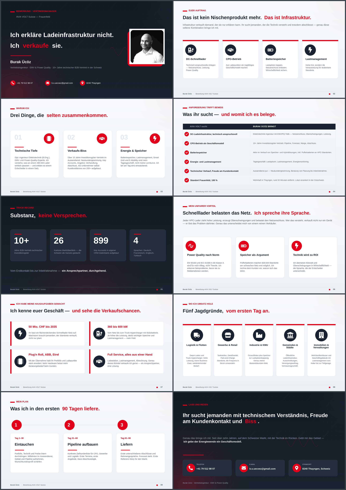

# Pitch-Deck · Bewerbung Vertriebsmanager — AVIA VOLT Suisse

Code-generiertes, voll markenkonformes Pitch-Deck (10 Slides, Deutsch) für die
Bewerbung von **Burak Ücöz** als Vertriebsmanager bei **AVIA VOLT Suisse**.
Das Deck wird vollständig per Python (`python-pptx`) erzeugt — Slide für Slide,
deterministisch und ohne externe Abhängigkeiten zur Laufzeit.

**Ergebnis:** [`Pitch_Burak_AVIA_VOLT.pptx`](Pitch_Burak_AVIA_VOLT.pptx)
&nbsp;·&nbsp; Ansehen ohne PowerPoint: [PDF-Vorschau](docs/Pitch_Burak_AVIA_VOLT_vorschau.pdf)



## Was drin steckt

- **10 Slides** mit klarem Spannungsbogen: Titel → Auftrag → Warum ich →
  Anforderung/Beweis → Track Record → Unfairer Vorteil → Hausaufgaben →
  Umsatzfelder → 90-Tage-Plan → Call to Action.
- **Speaker-Notes auf jeder Slide — nur für den Vortragenden.** Kurze
  Regie-Hinweise (Betonung, Pausen, Kernsätze), sichtbar in der
  Referentenansicht, nicht für das Publikum.
- **Einheitliches Design-System:** Dunkles Navy `#1B2430` + AVIA-Rot `#E2001A`,
  durchgehende Kicker-/Headline-/Footer-Logik, abgestimmte Karten, Badges und
  Typografie (Trebuchet MS / Calibri).
- **Eigene, immer passende Grafik:** Hintergründe (Energie-/Lade-Motiv, dezenter
  Verlauf, Power-Quality-Welle) werden mit Pillow generiert; die Icons und das
  Portrait werden markenkonform aufbereitet. Keine externen Bild-Hosts → keine
  toten Links, kein Layout-Bruch.

## Aufbau

| Datei | Zweck |
|-------|-------|
| `src/make_assets.py`   | Erzeugt Hintergründe + weiß eingefärbte Icon-Varianten |
| `src/build_deck.py`    | Baut die 10 Slides inkl. Speaker-Notes → `.pptx` |
| `src/render_preview.py`| Rendert die echte `.pptx` zur visuellen Kontrolle (PNG/PDF) |
| `assets/`              | Portrait, Original-Icons, generierte Assets |
| `docs/`                | Vorschaubilder + PDF-Vorschau |

## Neu bauen

```bash
pip install python-pptx Pillow
python3 src/make_assets.py     # Assets generieren
python3 src/build_deck.py      # Deck erzeugen -> Pitch_Burak_AVIA_VOLT.pptx
python3 src/render_preview.py  # optional: Vorschau-PNGs nach /tmp/preview

# hochaufgeloeste PNGs + PDF-Vorschau erzeugen:
PREVIEW_W=2600 PREVIEW_PDF=docs/Pitch_Burak_AVIA_VOLT_vorschau.pdf \
  python3 src/render_preview.py
```

## Hinweise

- Format 16:9, exakt passend zur Originalvorlage.
- Schriften: Trebuchet MS (Headlines) + Calibri (Fließtext) — Standard-Office-
  Schriften, damit die Datei auf jedem Rechner identisch aussieht.
- Inhaltlich entspricht das Deck dem Original, sprachlich leicht geschärft;
  Layout und Grafik wurden durchgehend angehoben.

---

# Kaltakquise-Maschine

CLI für Kaltakquise-E-Mails: Input rein (LinkedIn-Profil, News, Messenotiz,
Firmenname), zwei sendefertige Varianten plus Follow-up-Plan raus — jede
Variante automatisch gegen das Regelwerk geprüft.

```bash
pip install anthropic            # nur für die Erzeugung nötig
export ANTHROPIC_API_KEY=sk-...

# Mail erzeugen und prüfen
python3 kaltakquise.py "Implenia baut in Beringen ein Rechenzentrum für STACK, 36 MW, Baustart Q1"
python3 kaltakquise.py mail -d anfrage.txt --region de --effort xhigh

# Bestehenden Entwurf prüfen (offline, ohne API)
python3 kaltakquise.py pruefen entwurf.txt
python3 kaltakquise.py pruefen entwurf.txt --quelle input.txt   # prüft auch die Personalisierung

# Systemprompt ausgeben
python3 kaltakquise.py prompt
```

**Der Prüfer ist der Kern.** Er ist deterministisch — gleicher Text, gleiches
Urteil — und kontrolliert unter anderem: Preise im Erstkontakt, KI-Marker aus
der Blacklist, Gedankenstriche, Emojis, Aufzählungen, Betrefflänge, Wortzahl
des Fliesstexts, Anrede und Grussformel je Sprachregion, ss/ß, vollständige
Signatur, Verfügbarkeitszusagen, Norm-Schreibweise (IEC 61000-4-30 Klasse A,
EN 50160), Einheiten (kVA/kW/kWh), aufgelöste Fachkürzel, Superlative,
konkreter Call-to-Action, markierte Lücken und — wenn der Input mitgegeben
wird — ob überhaupt ein Detail daraus in der Mail steht.

Findet der Prüfer nach der Erzeugung Fehler, gehen sie automatisch als
Korrekturauftrag zurück ans Modell (Standard: bis zu 2 Runden, `--runden`).
Der Exit-Code ist `0` nur, wenn beide Varianten sauber sind — damit lässt sich
das Tool in Skripte hängen.

| Datei | Zweck |
|-------|-------|
| `kaltakquise.py` | Starter |
| `src/kaltakquise/regeln.py` | Regelwerk, maschinenlesbar |
| `src/kaltakquise/pruefer.py` | Prüfer, liefert Befunde nach Schwere |
| `src/kaltakquise/mail.py` | Zerlegt Mails, schneidet Varianten aus der Modellausgabe |
| `src/kaltakquise/client.py` | Claude-API plus Korrekturschleife |
| `src/kaltakquise/cli.py` | Kommandozeile |
| `prompts/` | Systemprompt |

Tests: `python3 -m unittest discover -s tests`
