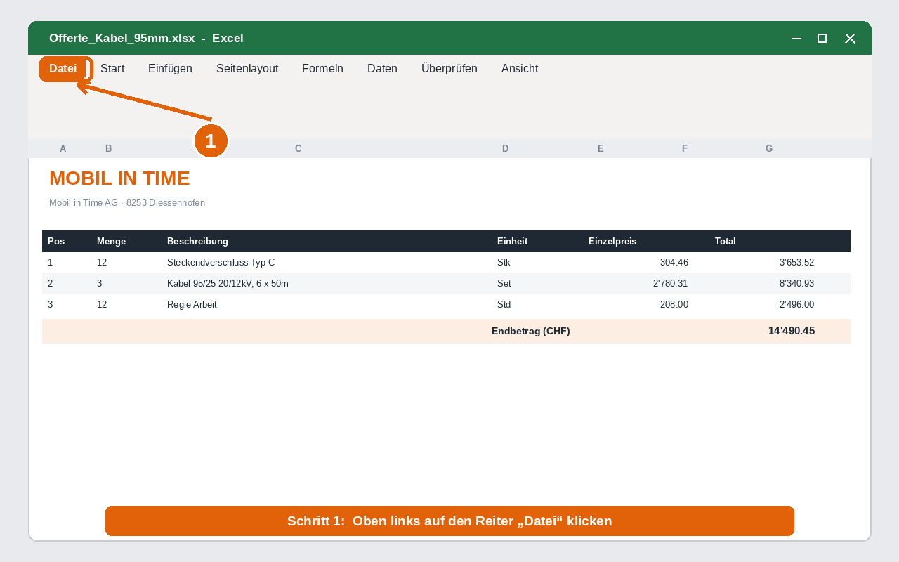
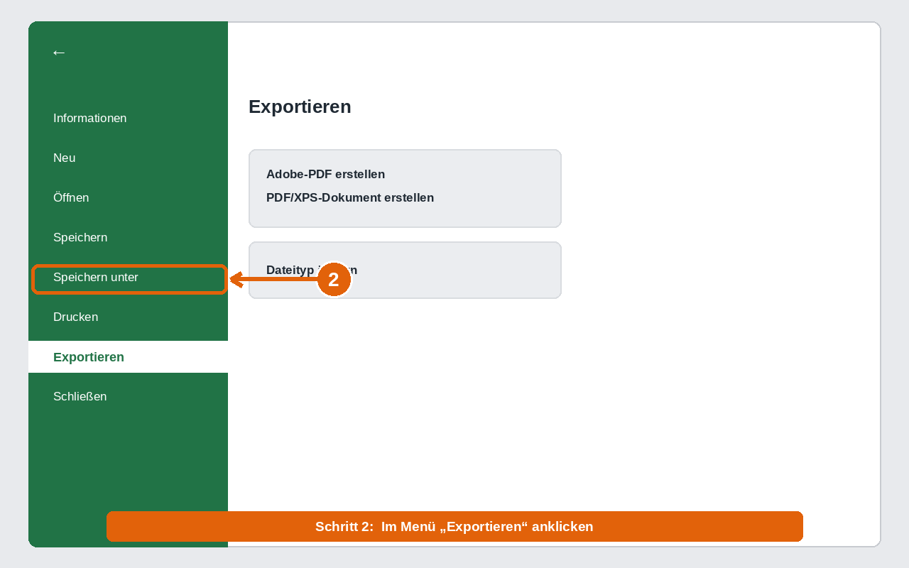
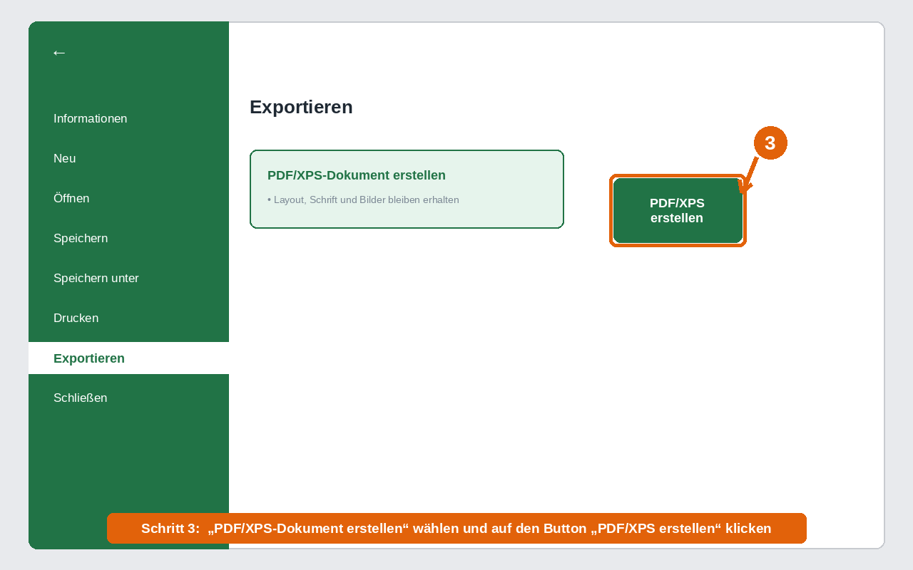
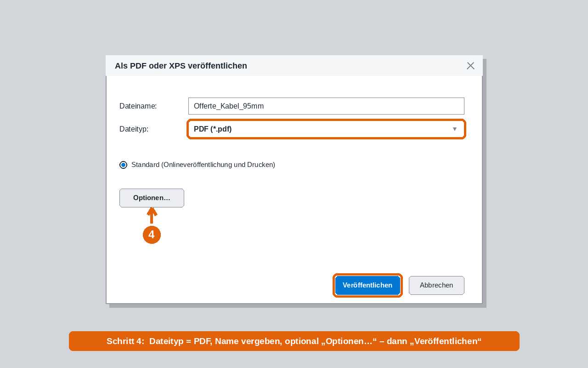
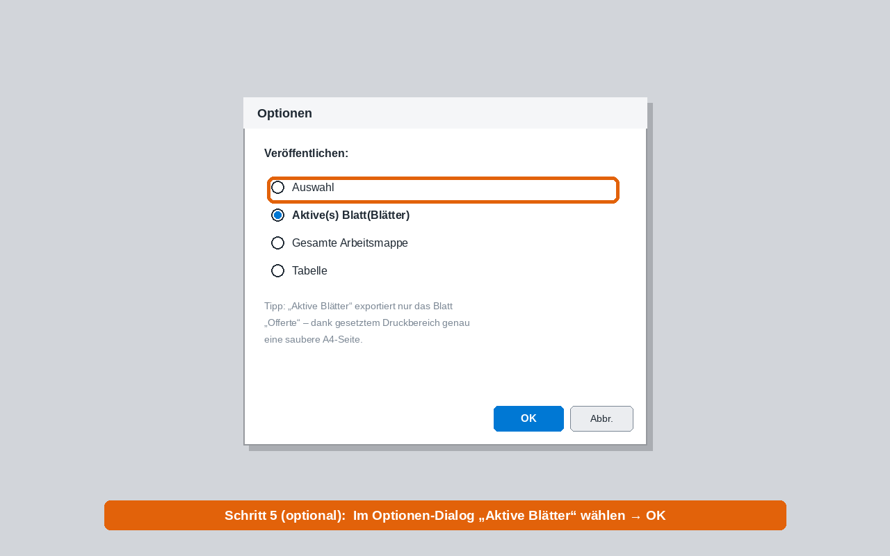
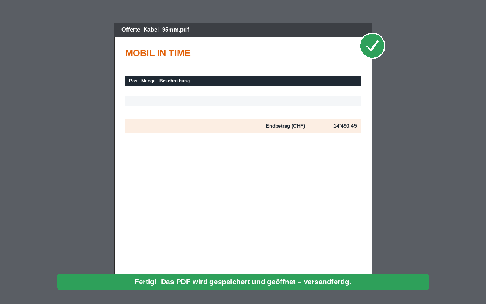
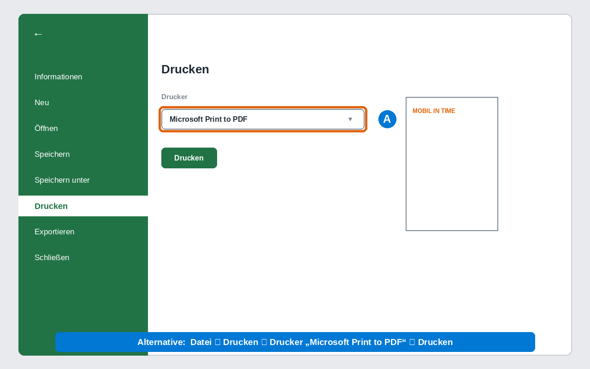

# 📄 Aus Excel ein PDF erstellen – Schritt für Schritt

Diese Anleitung zeigt **mit Bildern**, wie aus der Offerte (oder jeder Excel-Datei)
ein PDF wird. Es gibt drei Wege – **Weg A** ist der einfachste und funktioniert
in jedem Excel ohne Zusatzeinstellungen.

> 💡 **Tipp vorab:** In den Vorlagen ist der **Druckbereich** bereits gesetzt
> (Blatt *Offerte*, DIN A4). Dadurch wird das PDF automatisch eine saubere Seite.

---

## ✅ Weg A – „Exportieren“ (empfohlen, ohne Makros)

### Schritt 1 — Reiter „Datei“ öffnen
Oben links auf **Datei** klicken.



### Schritt 2 — „Exportieren“ wählen
Im linken Menü auf **Exportieren** klicken.



### Schritt 3 — „PDF/XPS-Dokument erstellen“
**PDF/XPS-Dokument erstellen** auswählen und auf den grünen Button
**PDF/XPS erstellen** klicken.



### Schritt 4 — Speichern & veröffentlichen
Im Fenster **„Als PDF oder XPS veröffentlichen“**:
1. **Dateiname** vergeben (z. B. `Offerte_Kabel_95mm`).
2. **Dateityp** muss **PDF (*.pdf)** sein.
3. Optional auf **Optionen…** klicken (siehe Schritt 5).
4. Auf **Veröffentlichen** klicken.



### Schritt 5 (optional) — nur das Offerten-Blatt exportieren
Im **Optionen**-Fenster **„Aktive(s) Blatt(Blätter)“** wählen → **OK**.
So landet nur das Blatt *Offerte* im PDF (nicht *Stammdaten*/*Artikel*).



### Fertig 🎉
Das PDF wird gespeichert und geöffnet – **versandfertig**.



---

## 🖨️ Weg B – „Drucken“ als PDF (Alternative)

Funktioniert genauso zuverlässig, falls „Exportieren“ einmal nicht da ist:

**Datei ▸ Drucken ▸** als Drucker **„Microsoft Print to PDF“** wählen ▸ **Drucken**.
Excel fragt dann nach Speicherort und Dateiname.



> Auf dem **Mac**: `Datei ▸ Drucken ▸` unten links **PDF ▸ „Als PDF sichern“**.

---

## ⚡ Weg C – PDF auf einen Klick (Knopf in Excel)

Wer es **mit einem Klick** möchte, baut einmalig eine Schaltfläche ein:
Mappe als **.xlsm** speichern, das Makro importieren und einer Schaltfläche
zuweisen. Komplette Anleitung in **[../vba/PDF_Knopf_Anleitung.md](../vba/PDF_Knopf_Anleitung.md)**
(Makro: `../vba/PdfButton.bas`).

Danach genügt ein Klick auf **„📄 PDF erstellen“** – das PDF heisst automatisch
wie die Offerte-Nr. und wird im Ordner der Mappe abgelegt.

---

## 🔧 Tipps für ein perfektes PDF

| Thema | So geht's |
|-------|-----------|
| **Nur eine Seite** | `Seitenlayout ▸ Skalierung ▸ Breite: 1 Seite` (ist in den Vorlagen schon gesetzt). |
| **Nur die Offerte** | In Schritt 5 **„Aktive Blätter“** wählen. |
| **Ränder/Format** | `Seitenlayout ▸ Format: A4`, `Ausrichtung: Hochformat` (bereits gesetzt). |
| **Vorschau prüfen** | `Datei ▸ Drucken` zeigt rechts die Seitenvorschau. |
| **Druckbereich ändern** | Bereich markieren ▸ `Seitenlayout ▸ Druckbereich ▸ festlegen`. |

---

### Bilder neu erzeugen
Die Abbildungen sind reproduzierbar:
```bash
python3 offerten/anleitung/make_anleitung_bilder.py
```
